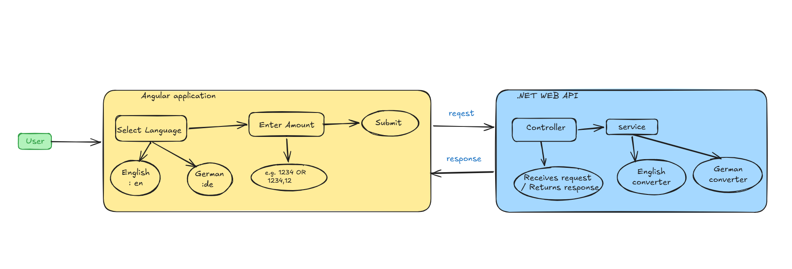
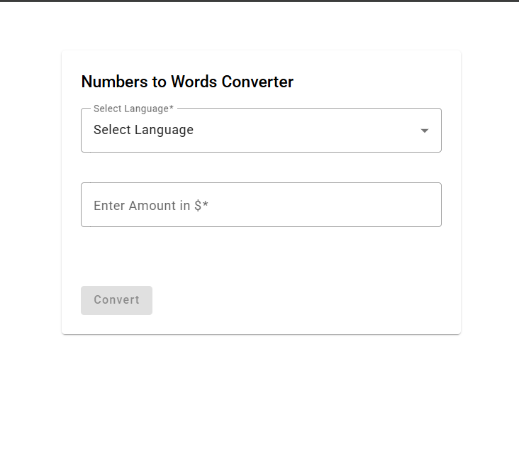
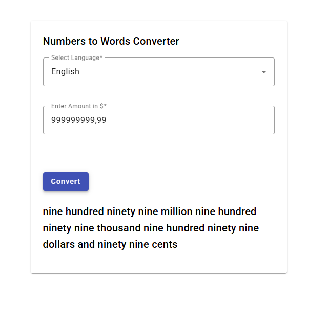
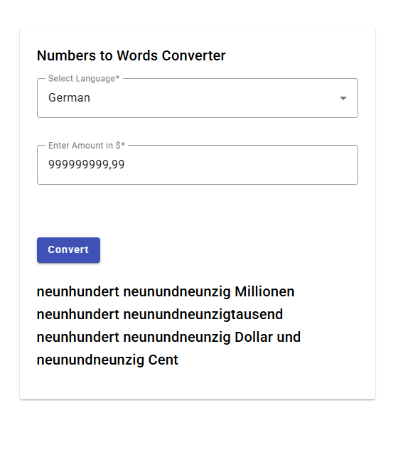
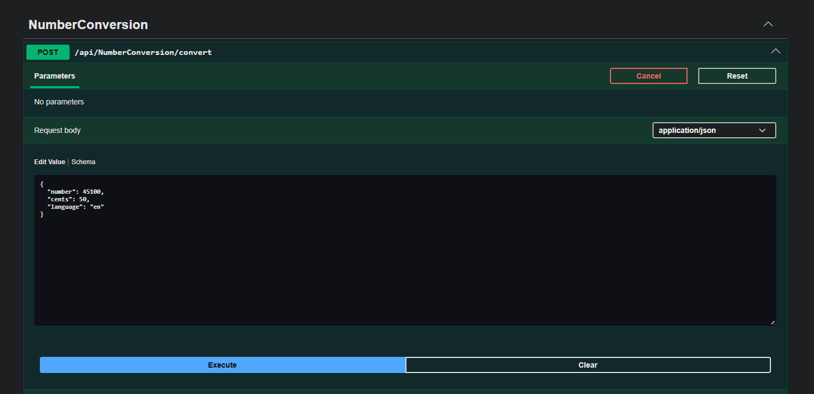
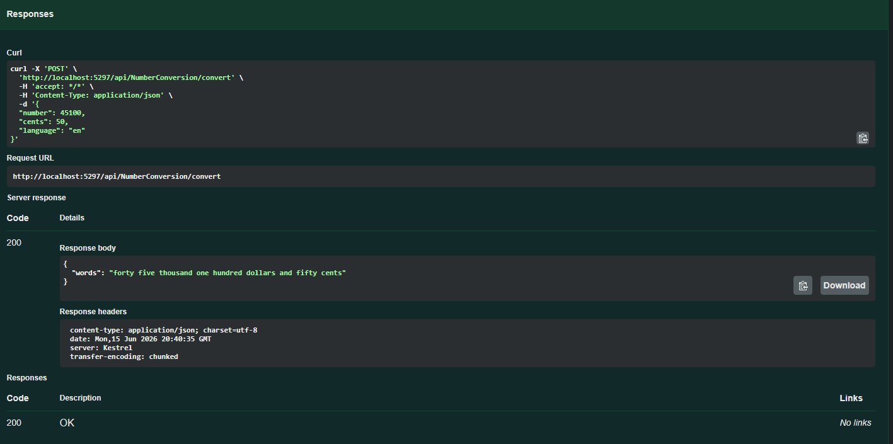
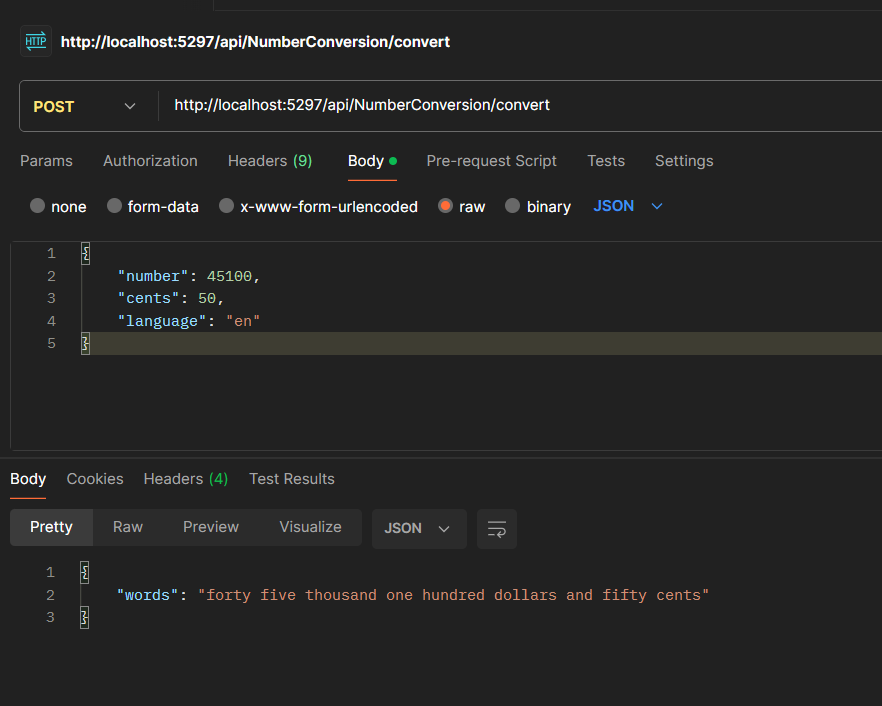
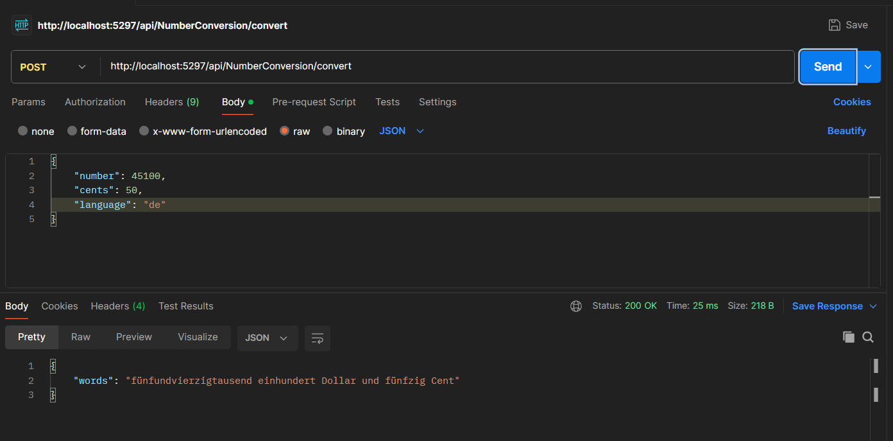
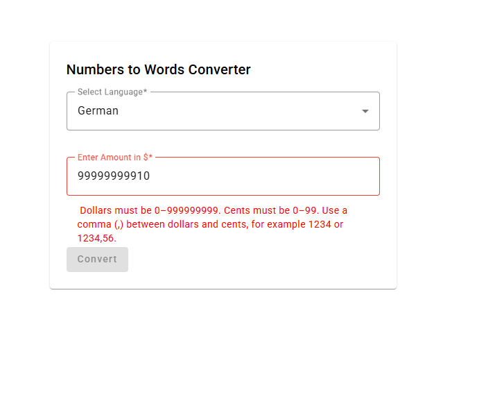
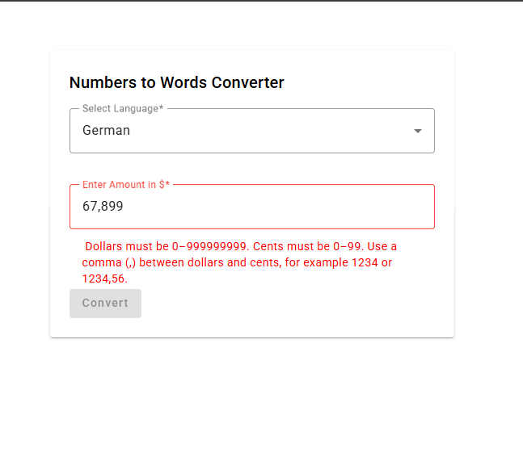

# Number to Words Converter

This is a web application that converts a currency amount into words. The application supports English and German.

The frontend is built with Angular, and the backend is built with ASP.NET Core Web API. The conversion logic is handled on the server side.

## What the application does

The user can:

* Select a language
* Enter an amount
* Submit the form
* See the amount converted into words

Example:

```text
1234,56
```

English result:

```text
one thousand two hundred thirty four dollars and fifty six cents
```

German result:

```text
eintausend zweihundert vierunddreißig Dollar und sechsundfünfzig Cent
```
## Architecture Overview

The diagram below shows the high-level flow of the application.



* The application follows a client-server architecture.
* The Angular frontend collects the language and amount from the user.
* The frontend sends the request to the .NET Core Web API.
* The backend handles the conversion logic on the server side.
* The controller receives the request and passes it to the service layer.
* The service selects the correct converter based on the selected language.
* The converted result is returned to the frontend and displayed on the UI.


## Screenshots

### Application UI



### English conversion



### German conversion



### Swagger API





### Postman API




### Validation screenshots





## Technologies used

Backend:

* .NET 10
* ASP.NET Core Web API
* C#
* Swagger
* Dependency Injection

Frontend:

* Angular
* Angular Material
* TypeScript
* Template-driven forms

## Project structure

The project has two parts:

```text
NumberToWords.Api       - Backend API
Number-To-Words-UI      - Angular frontend
```

In the backend, I used a simple layered structure:

```text
Controllers
Models
Services
Converters
Exceptions
Middlewares
Constants
```

I did not add a repository layer because there is no database in this application.

## How to run the backend

Go to the backend folder:

```bash
cd NumberToWords.Api
```

Restore and build the project:

```bash
dotnet restore
dotnet build
```

Run the API:

```bash
dotnet run
```

Swagger will be available at:

```text
http://localhost:5297/swagger
```

The main endpoint is:

```text
POST /api/NumberConversion/convert
```

Example request:

```json
{
  "number": 1234,
  "cents": 56,
  "language": "en"
}
```

Example response:

```json
{
  "words": "one thousand two hundred thirty four dollars and fifty six cents"
}
```

## How to run the frontend

Go to the frontend folder:

```bash
cd Number-To-Words-UI
```

Install dependencies:

```bash
npm install
```

Run the Angular application:

```bash
ng serve
```

Open the UI:

```text
http://localhost:4200
```

The frontend calls the backend API on:

```text
http://localhost:5297/api/NumberConversion/convert
```

So the backend should be running before testing from the UI.

## Input format

The amount should be entered using a comma between dollars and cents.

Valid examples:

```text
1234
1234,56
25,1
0,01
```

Invalid examples:

```text
1234.56
1234,567
abc
-25
25$
```

Rules:

* Dollars must be between 0 and 999999999.
* Cents must be between 0 and 99.
* A comma is used between dollars and cents.
* If one digit is entered after comma, it is treated as tens of cents.

  * Example: 25,1 means 25 dollars and 10 cents.

## Design decisions

I kept the backend structure simple because the application does not need a database.

The controller only receives the request and returns the response. The service decides which converter should be used based on the language selected by the user. The actual conversion logic is kept inside separate converter classes.

I used separate converter classes for English and German because both languages have different number formation rules. For example, English says "twenty one", but German says "einundzwanzig". Because of this, I did not try to translate English output into German. I implemented German conversion separately.

I used dependency injection for the service and converters. The service receives all available converters and selects the correct one using the language code.

I also added centralized exception handling middleware so that backend errors are returned in a consistent format.

## Assumptions

* The amount is treated as a dollar amount.
* The application currently supports only English and German.
* The comma is used as the separator between dollars and cents.
* The conversion is done on the server side.
* The application is intended to run locally.

## Limitations / known issues

* The frontend API URL is currently hardcoded for local development.
* Only English and German are supported.
* There is no database because the application does not need to store any data.
* The UI is kept simple and focused on the conversion functionality.
* The German conversion is implemented for this case study and may not cover every advanced grammar variation.
* For German output, some number groups are separated with spaces to make the result easier to read and understand, even though standard German number words are often written as one combined word.
* The backend and frontend must both be running locally for the application to work.

## Final note

I built this application with a simple client-server architecture. My main focus was to keep the responsibilities separated, validate the input on both frontend and backend, and keep the conversion logic on the server side as required.


## AI Usage Transparency
[AI Transparency Document](AI-usage.md)

## Author
Manali Naik